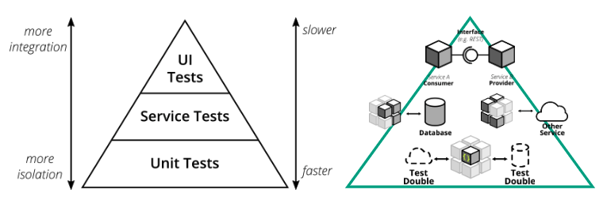

# Revolut birthday-service by Nathan Burn

## Table Of Contents

- [Plan](#plan)
- [Build](#build)
- [Test](#test)
- [Deploy](#deploy)
- [Operate](#operate)
- [Monitor](#monitor)
- [Discover](#discover)

## Plan

The plan will act as an ADR (Architectural Decision Record) for the "birthday-service" implementation, tracking the options, decisions and the reasoning that led to them.

### Source Control

- Source control via a `DVCS` (Distributed Version Control Systems) e.g. Git.
`Git` is now the default and industry recommended source control option, due to it providing multiple DevX (Developer Experience) benefits including; working offline, no single point of failure (distributed copies), and faster local operations.

- Git Collaboration Pattern, based on the "birthday-service" being a cloud-deployed application where we want to take advantage of continuously deploying a latest mainline release `GitHub Flow` is the recommended approach - developers work on short-lived feature branches which are integrated into mainline post successful tests and code review.
To aid with triage between versions, we will automate the tagging of the mainline branch on publishing of a release with the current semantic version.

### Data Store

The "birthday-service" will need to store each uesr's unique `username` and `date-of-birth` allowing for extensibility to store more attributes in future. The recommendation would be to use a relational SQL database to store a collections of `Users` - the options include `MySQL` or `PostgreSQL` - both are very popular open-source database options - the recommendation is to use `PostgreSQL` due to its; **performance and scalability** (geo spatial support and unrestricted concurrency — and deep, extensive data analysis across multiple data types), **concurrency** (multiversion concurrency control - MVCC, which enables the simultaneous occurrence of write operations and reads),**compatibility** (support for multiple programming languages, including Python, Java, JavaScript, C/C++ and Ruby), **business continuity** (high availability of services through asynchronous or synchronous replication methods across servers), and **cost-effective and flexible** (open-source database management innovation and technology - including support for JSON data types and jOOQ - Java Object Orientated Query).

### Infrastructure

The "birthday-service" application and data store will both need hosting to be accessible for use by customers.
For the best performance, scalability and reliability we should look to the major cloud providers (e.g. AWS, Azure and GCP), whilst continually reviewing the cost, required flexibility / configuration, and required redundancy.

`AWS` is the recommended infrastructure provider, supporting multiple service offerings, having the largest user base (of the three major cloud providers) and the engineering teams skill-set / experience.

#### Compute

AWS (and other major cloud providers) offer great flexibility and options when it comes to hosting engineering team **containerized** services and applications, three to consider are:

- `IaaS` (Infrastructure as a Service) `EKS` (Elastic Kubernetes Service) enables `kubectl` access to deploy and manage containerized services - requires dedicated operation support for management and security (managing worker nodes) but brings greater flexibility, control and sharing of a resource for an engineering team.
- `PaaS` (Platform as a Service) `EKS with Fargate` or `ECS with Fargate` (Elastic Container Service) provides a more managed approach where set-up and management of the hosting infrastructure is done by Fargate i.e. `Serverless` - requires reduced operational support, automated security updates, lower-level issue triage can be trickier (without access to kubectl on ECS), can be more cost-effective with the right configuration (i.e. accurate scaling configuration based on expected usage thresholds).
- `FaaS` (Function as a Service) `Lambda` also provides a `Serverless` option with no operational support, automated scaling, issue triage can be trickier (restricted access to infrastructure), can be more cost-effective with the right configuration (i.e. using `GraalVM` to create smaller and more performant binaries).

Based on the above to allow for flexibility on extending the "birthday-service" in the future, and allow for the creation of other DDD containerized services to be hosted in a shared resource - the recommendation is to use `EKS with Fargate` bringing the benefits of reduced operations and const control on our Kubernetes cluster, and providing the engineering team with access to more detailed configuration options in regards to scale and redundancy.

#### Database

As `PostgreSQL` (detailed above) is our preferred choice of database for the "birthday-service" application, `Amazon RDS` (Amazon Relational Database Service) is the recommended infrastructure for set-up, operation, and scaling the database in the cloud.

### System Diagram

Based on the infrastructure choices detailed above, below is a system diagram representation:


#### Notes

- `GitOps` - all the AWS infrastructure is managed via IaC (Infrastructure as Code), using standard AWS `Terraform` modules, to create plans with input and output configs - validated on each feature branch and then applied on merging to a mainline branch via a build tool (e.g. Jenkins)
- `Blue / Green` deployment strategy - two separate but identical environments for our deployed "birthday-service". One environment (blue) is running the current application version and one environment (green) is running the new application version. Increases application availability and reduces deployment risk by simplifying the rollback process if a deployment fails. Once testing has been completed on the green environment, live application traffic is directed to the green environment and the blue environment is deprecated.
- `Route 53` to maintain DNS records for the "birthday-service".
- `Web Application Firewall` - protect against common web exploits and bots that can affect availability, compromise security, or consume excessive resources.
- `Application Load Balancer` - automatically distributes incoming traffic across multiple targets, our blue / green environments and multiple Availability Zones.
- `Elastic Container Registry` - to store and share / deploy our service published Docker images and Helm charts.
- `AWS Xray` - to help analyze and debug production and distributed applications.
- `Amazon CloudWatch` - provides insights that help optimize application performance, manage resource utilization, and understand system-wide operational health.
- `IAM` - securely manage identities and access to AWS services and resources.

#### Future Extensions

- `Data Caching` - to speed up data retrieval we could configure a `Redis Cache` to work in conjunction with our database.
- `Message Queues` - to support better scalability e.g. `Apache Kafka`, `AWS SQS` (Simple Queue Service) or `RabbitMQ` could be used to have `PUT` requests raised as an event. This would require an update to the "birthday-service" implementation (to "publisher / subscriber messaging") but would allow for better management of high volume updates to the data whilst guaranteeing execution order.

## Build

The "birthday-service" will be built using DDD (Domain Driven Design) a service dedicated purely to creating users - based on a unique username and date-of-birth, returning a birthday message or count-down based on the current local date time.

### Language

The code for a Microservice could be written in most languages (e.g. Java, Go, C#, Python, TypeScript, Ruby, Groovy etc.), the decision will be based on the DevX (of the language, framework, ease-of-use, boilerplate options and tools), performance, and the engineering teams skill-set / experience.

`Java` (Java 17) using the `Spring Boot` open source framework (for building Java applications in the Java Virtual Machine (JVM) ecosystem), is the recommended choice. The Spring framework with Spring Boot simplifies application development and deployment through auto-configuration and convention over configuration.

### Run with Docker Compose

Prerequisites:

- Installed Docker (and Docker Compose is enabled)

Steps:

1. Run App and PostgreSQL Database with Docker Compose:

    ```bash
    docker compose up --force-recreate --build -d
    ```

2. Navigate to `http://localhost:8080` in your browser.

3. Check running containers and logs with Docker Compose:

    ```bash
    docker compose ps
    docker compose logs
    ```

4. Tear down with Docker Compose:

    ```bash
    docker compose down
    ```

#### Get export from PostgreSQL Database in container

Execute to capture `pg_dump` of the local database:

```bash
docker exec -i db pg_dump -U birthday-service-user -h db -p 5432 birthday-service >> /Users/[USERNAME]/Documents/dumpFile.sql
```

### Build and Run Locally

Prerequisites:

- Installed Java 17 JDK
- Installed Maven

#### Run App with Maven Spring-Boot

1. Run with `maven` spring boot:

    ```bash
    mvn spring-boot:run
    ```

2. Navigate to `http://localhost:8080` in your browser.

#### Or run App with JAR file

1. Build with `maven` package:

    ```bash
    mvn clean package
    ```

2. Run with `jar` file:

    ```bash
    java -jar target/birthday-service-0.0.1-SNAPSHOT.jar
    ```

3. Navigate to `http://localhost:8080` in your browser.

### Continuous Integration


Using pipelines-as-code with `GitHub Actions` (or `Jenkins`), we can help to manage a set of standard build stages and gates, from:

- compiling the code and providing a unique semantic version (based on the current service version, branch and build number),
- automated gating on unit test execution, and static code analysis (for highlighting code and style smells, to bugs and code coverage checks),
- linting, building and publishing Docker images, Terraform modules and Helm charts – which are pushed into an artifact store and scanned and gated upon for vulnerabilities (e.g. `Snyk` or `JFrog Xray`)
- with a final build pipeline gate on functional validation of the more comprehensive test suites (including integration, contract, UI, penetration and performance testing) helping to ensure these test suites don’t go stale and are extended for new functionality
- then on a successful completion of all these stages – a release bundle for the semantic version is created and distributed to an artifact store (e.g. `ECR` or `JFrog Artifactory`)

With all these stages reporting back to an internal instance of `Grafeas` capturing the key meta data of build and test attestations.

### Build Script

```bash
bash build.sh "birthday-service" "main"
```

## Test

### TDD (Test Driven Development)

Unit tests have been created as part of a TDD methodology, supporting understanding and expected validation of existing and future functionality.
These tests are executed as part of the build process, and passing these tests and their code coverage percentage for new functionality code should be used in automatically gating feature branch pull-requests / merges to the mainline branch.

### Continuous Testing

Our build and deployment pipelines promote and enable automated quality assurance - "Build, test, provide infrastructure, deploy and test more!"



We will use the `Test Pyramid` to guide a depth in test coverage, from unit tests, to integration tests, contract tests, up to system UI tests - powered by industry standard frameworks like `PACT`, `K6`, `Taurus` (JMeter), `Selenium` and the `Robot Framework`.

## Deploy

### Continuous Deployment


Deployment can be triggered a based on the presence of a release bundle / artifact for our configured service – using a tool like `Jenkins` (or `CircleCI`) again using pipeline-as-code to manage a set of standard build stages and gates, from:

- initially validating the release bundle / artifacts – that they have come from the expected source (our artifact store) and have the required or expected build and test attestation records in our `Grafeas` instance
- Docker images are pushed from an internal artifact store to our public ACRs which our clusters have access to pull from,
the Terraform plans are applied for the current environment (e.g. `green`) and each region – for updating our Database (or Cache) configuration per region
- then we upgrade the service with our latest Helm charts – updating the per environment and multi-region deployments - following a `Rolling Update` strategy - allowing an update to take place with zero downtime by incrementally updating Pods instances with new ones
- as a final stage and gate we run our comprehensive versioned test suite via helm test incl. integration, performance, penetration and UI tests
- in the event of deployment or test failures - we can alert the engineering team (e.g. via `Slack` notification) to investigate on the `green` environment
- if all stages are successful however, we can automatically (or via a manual-judgement) update the application load balancer to switch traffic from the `blue` to `green` cluster.

Again all these stages are reporting back to an internal instance of `Grafeas` capturing the key meta data of deployment and test attestations.

### Deployment Script

```bash
bash deploy.sh "birthday-service" "green"
```

## Operate

The infrastructure will need management for security and patch updates (managed via GitOps), network and scaling configuration plans (managed via GitOps), and reviewing of costs including for underutilized cloud resources.

## Monitor

Observability in every layer is vital to understand performance, this includes using industry standard tooling like:

- `CloudWatch` and `DataDog` for monitoring and alerting on infrastructure events and metrics,
- `Splunk` and `New Relic` for logging, monitoring, tracing and alerting of our hosted services,
- `Grafeas` for monitoring and tracing our own build and release tooling – enabling `DORA` (DevOps Research and Assessment) metrics reporting - including:

  - tracking deployment frequency,
  - lead time on changes,
  - recovery times,
  - and failure rates

## Discover

Through the monitoring of our infrastructure and application we can learn how to improve it for better performance, reliability, redundancy and scalability - build these discoveries into future plans (work items), completing the DevOps infinity loop!
