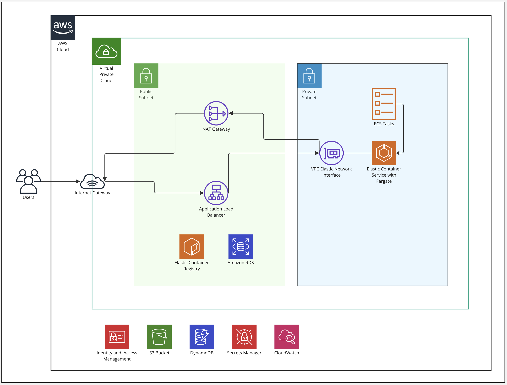

# Terraform for AWS Infrastructure

## Summary

The `Terraform` IaC (Infrastructure as Code) files within `deploy/terraform` create a parameterized secure managed AWS ECS instance and dependencies, for the `birthday-service` Docker image and PostgreSQL database.

As elements of the secure managed AWS infrastructure incur costs outside of a free trial e.g. `NAT Gateways` - I would prefer to re-`apply` the terraform to my AWS account before a scheduled review interview (with Sean and Carlos), in-between Sean and Carlos will be able to review all the Terraform files and documentation to review my implementation (with the Terraform IaC files providing an easier and conclusive review).

## Design Overview



Terraform manages the following resources:

- `S3 Bucket` and `DynamoDB` as the Terraform 'backend' and related 'lock'
- `IAM User` and `IAM Policy` with 'ReadOnlyAccess' (for Sean and Carlos)
- `Virtual Private Cloud` to secure our resources from the public cloud
- `Public Subnets` and `Private Subnets` (per `Availability Zone`)
- `Routing Tables` for the Subnets
- `Internet Gateway` for Public Subnets
- `NAT Gateway` with attached `Elastic IP` for the Private Subnets
- `Security Groups` for HTTP access and the configured container port
- `Application Load Balancer` incl. target group with listeners for port 80
- `Elastic Container Registry` for the Docker images
- `Elastic Container Service`  cluster with a service (incl. auto scaling policies for CPU and memory usage)
  and task definition to run docker containers from the ECR (incl. IAM execution role)
- `Secrets Manager` - a Terraform module creates secrets based on a `map` input value, and has a list of secret ARNs as output values
- `Relational Database Service` to manage a PostgreSQL database (for our deployed `birthday-service`)
- `Cloud Watch Metric Alarms` for ECS high / low CPU and high / low Memory, and ELB target HTTP 5XX count and target response times.

## Post Terraform Setup

The following steps are required post the initial `terraform apply` step are required to create an empty database and push a Docker image for the `birthday-service`.

### Create Database in the RDS PostgreSQL

```bash
psql -p 5432 -U birthday_service_user -d postgres -h birthday-service-db-test.cph09d7iwtjg.us-east-2.rds.amazonaws.com

CREATE DATABASE birthday_service;

\l

exit;
```

### Push Docker image to ECR

```bash
aws ecr get-login-password --region us-east-2 | docker login --username AWS --password-stdin 156471115370.dkr.ecr.us-east-2.amazonaws.com

docker build -t birthday-service .

docker tag birthday-service:latest 156471115370.dkr.ecr.us-east-2.amazonaws.com/birthday-service-test:latest

docker push 156471115370.dkr.ecr.us-east-2.amazonaws.com/birthday-service-test:latest
```

## Example `birthday-service` Requests

View all users:

```http
GET /users
```

Add new user, with a username (in the URL) and date-of-birth:

```http
PUT /hello/john
Content-Type: application/json
{
    "dateOfBirth": "1986-05-07"
}
```

View a user's unique birthday message / count-down:

```http
GET /hello/john
```
